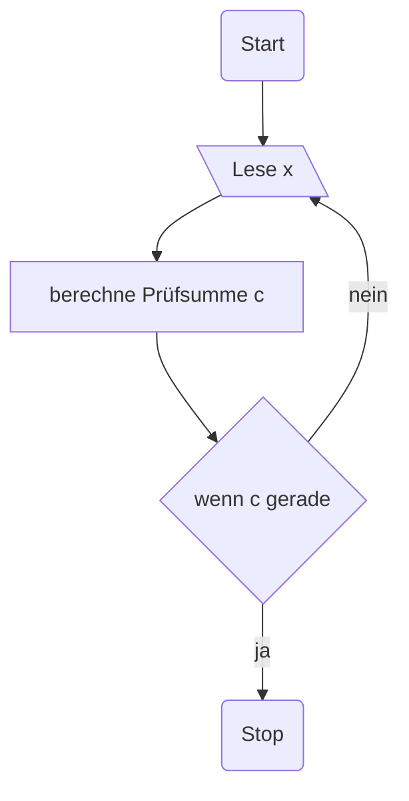

# Markdown
## Was kann Markdown
- Überschriften
- Listen
- Tabellen
- Links
- Diagramme (mermaid)

```mermaid
flowchart TD
    A(Start)
    B[\Lese x\]
    C[berechne Prüfsumme c]
    D{wenn c gerade}
    E(Stop)
    A --> B --> C --> D
    D -->|ja| E
    D -->|nein| B
```