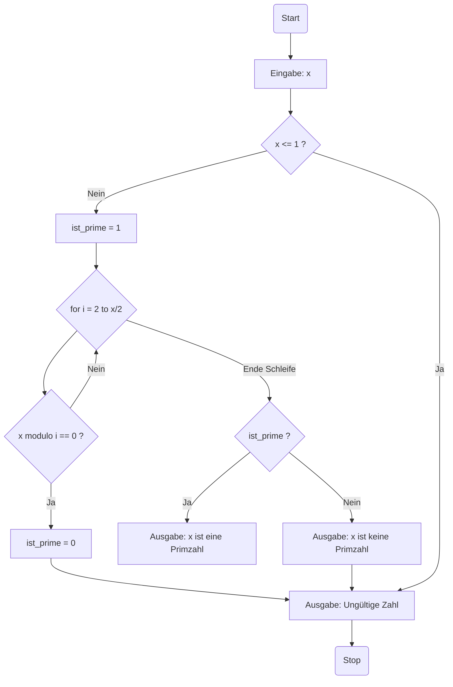

# Primzahlen prüfen

Pseudocode

 Zahl = x
Zahl x lesen
Wenn x < oder = 1 ist ungültig
Setze ist_prime auf 1 Annahme: x ist eine Primzahl.
Wenn x durch i(2) teilbar ist, setze ist_prime auf 0 (x ist keine Primzahl) und breche die Schleife ab.
Wenn ist_prime gleich 1 ist, gib "x ist eine Primzahl" aus, sonst gib "x ist keine Primzahl" aus.
Beende das Programm.

pseudocode mit Chatgpt

Eingabe: Eine natürliche Zahl x
Ausgabe: Eine Meldung, ob x eine Primzahl ist oder nicht

Lese eine Zahl x von der Benutzereingabe ein.
Wenn x kleiner oder gleich 1 ist, dann gib "Ungültige Zahl" aus und beende das Programm.
Setze ist_prime auf True (Annahme: x ist eine Primzahl).
Iteriere über alle Zahlen i von 2 bis zur Wurzel von x:
     4.1 Wenn x durch i teilbar ist, setze ist_prime auf False (x ist keine Primzahl) und breche die Schleife ab.
Wenn ist_prime gleich True ist, gib "x ist eine Primzahl" aus, sonst gib "x ist keine Primzahl" aus.
Beende das Programm.

## Flussdiagramm:

